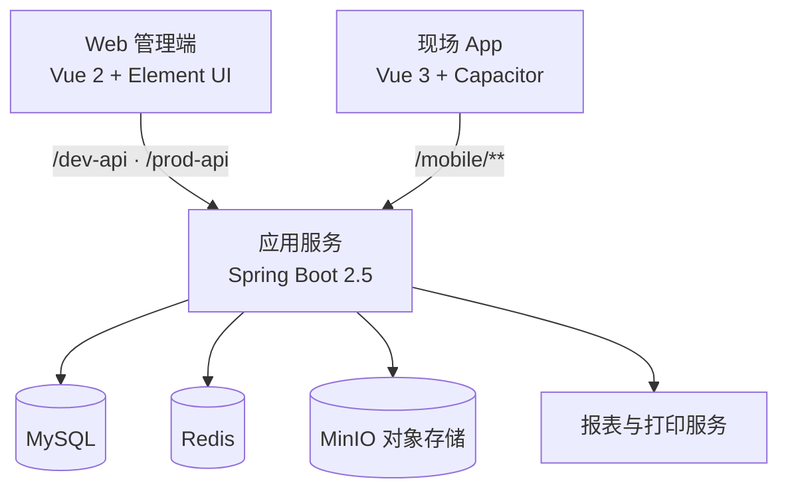

# 王有用 MES 管理平台

面向离散制造企业的生产执行管理系统（Manufacturing Execution System，MES）。项目提供 Web 管理端、Spring Boot 后端及面向现场人员的 Android App，覆盖主数据、生产、质量、仓储、设备与报表等业务场景。

[在线体验](https://kywgmes.cn/login?redirect=%2Findex) · [问题反馈](https://github.com/seventeen199303-rgb/mes/issues)

> 演示环境仅用于体验，请勿修改公共账号、数据或系统配置。

## 功能概览

| 业务域 | 主要能力 |
| --- | --- |
| 平台与权限 | 用户、角色、菜单、部门、岗位、字典、参数、公告、日志、在线用户与代码生成 |
| 主数据 | 物料/产品、工艺路线、工作站、客户、供应商、BOM、班组及相关基础资料 |
| 生产执行 | 生产计划与排产、生产工单、工序流转、任务派工、扫码报工、领退料、完工入库 |
| 质量管理 | 检验模板、检验任务与结果记录、质量相关业务单据 |
| 仓储与条码 | 库存现有量、入出库、库位、库存移动、条码与装箱等作业 |
| 设备与工装 | 设备、工装、点检/保养及现场相关资料管理 |
| 排班与报表 | 工作日/节假日、排班日历、统计报表与打印能力 |
| 移动现场端 | 移动登录、个人信息、通知、生产任务、报工、工序流转及现场业务入口 |

## 系统架构



## 仓库结构

```text
.
├── ktg-mes/                 # Java 后端（多模块 Maven 工程）
│   ├── ktg-admin/           # Spring Boot 启动模块、接口与配置
│   ├── ktg-common/          # 通用工具、常量与基础能力
│   ├── ktg-framework/       # 安全、权限、Web 与框架配置
│   ├── ktg-system/          # 系统管理模块
│   ├── ktg-mes/             # MES 领域模块
│   ├── ktg-quartz/          # 定时任务模块
│   ├── ktg-generator/       # 代码生成模块
│   └── sql/                 # 数据库初始化脚本
├── ktg-mes-ui/              # Web 管理端（Vue 2 + Vue CLI）
└── ktg-mes-app/             # 现场 App（Vue 3 + Vite + Capacitor）
```

Web 管理端的 MES 页面按业务划分为：`md`（主数据）、`pro`（生产）、`qc`（质量）、`wm`（仓储）、`dv`（设备）、`cal`（日历/排班）、`tm`（工装）和 `report`（报表）。

## 技术栈

| 层级 | 技术 |
| --- | --- |
| 后端 | Java 8、Spring Boot 2.5、Spring Security、MyBatis、PageHelper、Druid、Quartz、Swagger 3 |
| 数据与中间件 | MySQL、Redis、MinIO |
| Web 管理端 | Vue 2、Vue Router、Vuex、Element UI、Axios、ECharts、DHTMLX Gantt |
| 现场 App | Vue 3、Vite、Capacitor 7、Android |
| 构建工具 | Maven、npm、pnpm、Gradle |

## 环境要求

| 组件 | 建议版本 | 用途 |
| --- | --- | --- |
| JDK | 8 | 后端编译与运行 |
| Maven | 3.6+ | 后端构建 |
| MySQL | 5.7+ / 8.0+ | 业务数据存储 |
| Redis | 6+ | 缓存与会话相关能力 |
| Node.js | 16 LTS（Web）/ 20+（App） | 前端构建与运行 |
| pnpm | 9+ | App 依赖管理 |
| Android SDK | Platform 35、Build Tools 35 | 构建 Android App（可选） |
| Java 21 | - | Android App 构建（可选） |

## 快速开始

### 1. 初始化数据库

创建 MySQL 数据库 `jian_mes`，并按需要导入以下脚本：

```text
ktg-mes/sql/ry_20210908.sql  # 系统与业务基础数据
ktg-mes/sql/quartz.sql       # Quartz 定时任务表
```

> 生产环境请使用独立数据库账户，并在导入前审阅脚本内容及字符集配置。

### 2. 配置并启动后端

后端默认配置位于：

```text
ktg-mes/ktg-admin/src/main/resources/application.yml
ktg-mes/ktg-admin/src/main/resources/application-druid.yml
```

数据库、Redis 和 MinIO 均支持使用环境变量覆盖。示例：

```bash
export DB_MASTER_HOST=127.0.0.1
export DB_MASTER_PORT=3306
export DB_MASTER_USERNAME=mes_user
export DB_MASTER_PASSWORD='请替换为安全密码'

export REDIS_HOST=127.0.0.1
export REDIS_PORT=6379
export REDIS_PASSWORD='请替换为安全密码'

export MINIO_ENDPOINT=http://127.0.0.1:9000
export MINIO_ACCESSKEY='请替换'
export MINIO_SECRETKEY='请替换'
export MINIO_BUCKETNAME=mes
```

构建并运行：

```bash
cd ktg-mes
mvn clean package -DskipTests
java -jar ktg-admin/target/ktg-admin.jar
```

服务默认监听 `http://localhost:8080`。启用 Swagger 时，可通过 `http://localhost:8080/swagger-ui/index.html` 查看接口文档。

### 3. 启动 Web 管理端

```bash
cd ktg-mes-ui
npm install
npm run dev
```

开发环境默认将 `/dev-api` 和 `/ureport` 代理至 `http://localhost:8080`。端口及代理规则见 `ktg-mes-ui/vue.config.js`，环境变量位于 `ktg-mes-ui/.env.*`。

生产构建：

```bash
npm run build:prod
```

构建产物输出到 `ktg-mes-ui/dist/`。部署到 Nginx 等 Web 服务器时，需要将 `/prod-api` 反向代理到后端服务。

### 4. 启动现场 App

```bash
cd ktg-mes-app
pnpm install
pnpm dev
```

浏览器默认访问 `http://localhost:4173`。通过本地 `.env` 文件中的 `VITE_MES_API_BASE_URL` 配置接口地址；真机或 Android 模拟器访问开发机后端时，请填写开发机的局域网 IP，不要使用 `localhost`。

构建 Android 调试包：

```bash
pnpm build
pnpm android:sync
cd android
./gradlew assembleDebug
```

调试 APK 位于：

```text
ktg-mes-app/android/app/build/outputs/apk/debug/app-debug.apk
```

## 部署建议

1. 将后端与 MySQL、Redis、MinIO 部署在受控网络中，使用环境变量或密钥管理服务提供凭据。
2. 使用 Nginx 托管 `ktg-mes-ui/dist`，将 `/prod-api` 代理到后端 `8080` 端口。
3. 开启 HTTPS，并在反向代理层限制管理端、Druid 与 Swagger 的访问来源。
4. 将上传文件目录、日志与数据库备份放在持久化磁盘，建立定期备份与恢复演练流程。
5. 在生产环境关闭不必要的调试能力，替换所有示例口令、JWT 密钥及默认账户配置。

## 常用接口前缀

| 前缀 | 说明 |
| --- | --- |
| `/dev-api` | Web 管理端开发环境 API 前缀 |
| `/prod-api` | Web 管理端生产环境 API 前缀 |
| `/mobile/login` | 移动端登录 |
| `/mobile/app` | 移动端首页、个人资料、通知与版本信息 |
| `/mobile/pro/execution` | 移动端生产任务执行、开工、完工、报工与转序 |
| `/ureport` | 报表服务代理路径 |

## 安全说明

- 不要提交 `.env`、数据库导出、密钥、访问令牌或生产环境配置。
- 修改 `application.yml`、`application-druid.yml` 中的示例配置后再部署生产环境。
- 对数据库、Redis、MinIO 与管理后台设置独立的强密码，并限制网络访问范围。
- 发现凭据泄露时，请立即轮换凭据并审查相关访问日志。

## 许可证与致谢

本仓库由多个子项目组成；请分别遵循各子项目及其第三方依赖的许可证声明。系统后端基于 RuoYi 前后端分离架构进行扩展，感谢开源社区提供的基础能力与组件。

---

如需提交问题或改进建议，请通过 [GitHub Issues](https://github.com/seventeen199303-rgb/mes/issues) 反馈。
